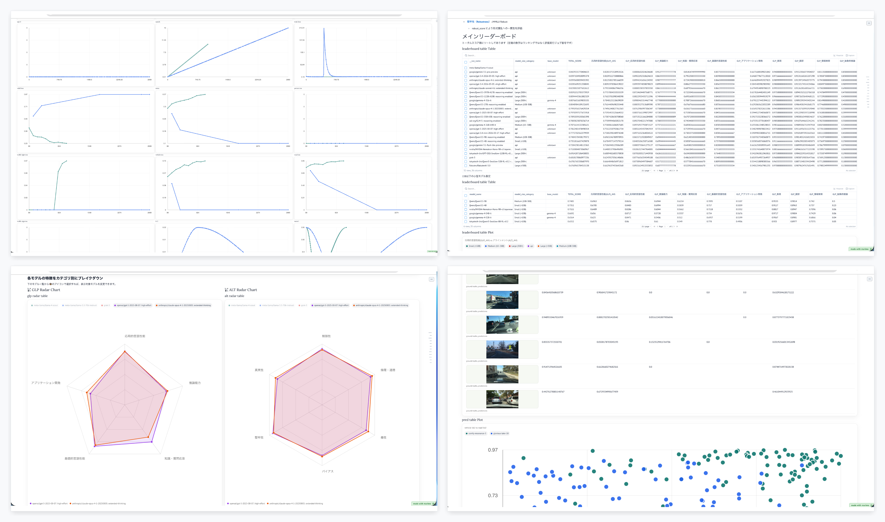

# W&B Report Exporter


This repository currently focuses on exporting a W&B Report into a `marimo HTML-WASM` viewer for local, self-contained exploration.

The goal is report-first export: preserve the original W&B report structure, panels, tables, media, and chart behavior as much as possible while serving everything from local files.

## Public Sample

This repository ships a fixed MNIST sample snapshot under `examples/mnist-sample/processed/`.

Public demo:

- Exported static sample: <https://nejumi.github.io/wandb-report-exporter/>
- Original W&B Report: <https://wandb.ai/wandb-japan/mnist-pytorch-20260309_073605/reports/Sample-Report--VmlldzoxNjQ0Njg4Ng>

Use it locally:

```bash
make sample-build
make marimo-serve
```

The repository also includes a GitHub Pages workflow that builds the same sample into a public static demo on pushes to `main` and via manual dispatch.

## What It Exports

`scripts/export_wandb_snapshot.py` builds a snapshot with:

- report blocks and panel metadata
- the latest accessible saved draft state when W&B exposes one
- report-scoped runs only, inherited from the report runset/filter when available
- run unions across report runsets when a report mixes multiple panel-level runsets
- run summaries
- offline history rows for report charts
- panel tables as JSON
- local media assets for images, masks, and supported Plotly payloads
- artifact lineage metadata for lineage panels
- persistent per-run history caching to speed up repeated exports

The exported snapshot is then consumed by:

- `marimo_viewer/dist/` for the marimo HTML-WASM viewer
- `dist/` for the legacy Observable reference viewer

## Setup

### Python

```bash
uv sync
```

This installs the default marimo-first toolchain, including the exporter and marimo HTML-WASM build support.

If you need the optional report/workspace extras:

```bash
uv sync --extra reports
```

### Frontend

```bash
npm install
```

The frontend uses Node.js `>=20`.

## Configuration

Copy `.env.example` to `.env` if you want environment-based configuration.

Important variables:

- `WANDB_API_KEY`: required for live export from W&B
- `WANDB_BASE_URL`: optional W&B host override for Dedicated / Self-Managed Cloud. If omitted, the exporter infers it from the report URL host for non-public deployments. You normally do not need to set this for `wandb.ai`.
- `WANDB_REPORT_URL`: the W&B report URL to export
- `WANDB_ENTITY`, `WANDB_PROJECT`: optional when the report URL already contains them
- `WANDB_HISTORY_KEYS`: optional extra history keys to force-export
- `WANDB_MAX_RUNS`: safety cap for exported runs
- `WANDB_TABLE_NAME`, `WANDB_TABLE_ARTIFACT`: optional manual overrides for difficult table resolution cases
- `WANDB_EXPORT_WORKERS`: optional concurrency override for history/table/media export work
- `WANDB_ENABLE_PRIMARY_TABLE_SCAN=1`: opt into the slower legacy primary-table crawl used by the old Observable fallback

In most cases, the simplest workflow is to pass the report URL directly on the command line.

If you are exporting from a non-public W&B deployment, make sure your login and API key match that host. For example:

```bash
WANDB_BASE_URL="https://wandb.my-company.example" wandb login --relogin
```

## Quick Start

### 1. Export a report snapshot

```bash
uv run python scripts/export_wandb_snapshot.py "https://wandb.ai/<entity>/<project>/reports/..."
```

If credentials are missing, the exporter falls back to sample data so you can still build and test the marimo viewer.

The first live export can take a while. For larger reports, it is normal for this step to take several minutes while W&B history, tables, artifacts, and media are being fetched.

Recent versions of the exporter print per-phase progress, so you should now see which stage is active even during long downloads.

If the same report has already been exported and the archived snapshot matches the current report metadata, the exporter reuses that snapshot automatically instead of downloading everything again. Pass `--refresh-snapshot-cache` if you want to force a fresh export.

### 2. Build and serve the marimo viewer

```bash
make marimo-build
make marimo-serve
```

Open `http://localhost:8124`.

The exported site now shows an explicit loading overlay while marimo hydrates the page, and heavier history/custom-chart panels load lazily after the main report shell becomes visible.

## Common Workflows

### Full marimo flow

```bash
make export
make verify-export
make marimo-build
make marimo-serve
```

### Build the fixed public sample locally

```bash
make sample-build
make marimo-serve
```

If you prefer not to use environment variables, run the export step directly with the report URL instead of `make export`.

### Stop the local marimo server

```bash
make marimo-stop
```

## Output Layout

- `extracted/processed/`: canonical exported snapshot
- `extracted/snapshots/<report-slug>-<hash>/<timestamp>/processed/`: archived snapshots kept per exported report for repeat testing
- `examples/mnist-sample/processed/`: fixed sample snapshot used for the public demo and local sample builds
- `marimo_viewer/wandb_report.py`: generated marimo notebook
- `marimo_viewer/dist/`: final marimo HTML-WASM site
- `app/src/data/`: data bundle for the legacy Observable reference viewer
- `app/src/media/`: media bundle for the legacy Observable reference viewer
- `dist/`: final Observable static site

## Git Hygiene

Exported content and local build artifacts are meant to stay out of version control.

The repository's `.gitignore` is set up so that the following stay local by default:

- `extracted/processed/` and `extracted/raw/`
- `extracted/snapshots/`
- `app/src/data/` and `app/src/media/`
- `marimo_viewer/dist/`, `marimo_viewer/generated_assets/`, and generated marimo notebook payload files
- `dist/`
- `artifacts/`
- `output/`
- local editor and Codex metadata such as `.vscode/` and `.codex/`

In normal use, you should commit source files, tests, and docs, but not downloaded W&B content or generated export output.

## Support Matrix

This matrix is based on W&B’s public docs plus the current SDK/source surface, and then mapped onto what this exporter actually does today.

Primary references:

- W&B report editing docs: <https://docs.wandb.ai/models/reports/edit-a-report>
- W&B data type overview: <https://docs.wandb.ai/models/ref/python/data-types>
- W&B custom charts docs: <https://docs.wandb.ai/models/app/features/custom-charts>
- W&B tables docs: <https://docs.wandb.ai/models/tables/visualize-tables>
- W&B lineage docs: <https://docs.wandb.ai/models/registry/lineage>
- W&B SDK source:
  - `Image`: <https://github.com/wandb/wandb/blob/main/wandb/sdk/data_types/image.py>
  - `Object3D`: <https://github.com/wandb/wandb/blob/main/wandb/sdk/data_types/object_3d.py>
  - `Molecule`: <https://github.com/wandb/wandb/blob/main/wandb/sdk/data_types/molecule.py>
  - `Plotly`: <https://github.com/wandb/wandb/blob/main/wandb/sdk/data_types/plotly.py>

Status legend:

- `Supported`: works in normal marimo export flow today
- `Partial`: exported and rendered in some form, but with meaningful gaps versus W&B
- `Unsupported`: not reconstructed offline yet; marimo should show a per-panel note instead of crashing

| W&B surface | W&B capability | Exporter status | Current behavior / gaps |
| --- | --- | --- | --- |
| Report markdown blocks | W&B reports support Markdown blocks and rich report text | Supported | Exported as report blocks and rendered in marimo. |
| Report code blocks | W&B reports support syntax-highlighted code blocks | Supported | Exported and rendered as offline code blocks. |
| Report image blocks | W&B reports support image blocks in the body of a report | Supported | Static images are copied locally and rendered offline. |
| Report HTML elements / embedded rich links | W&B reports support HTML elements and embedded rich-media links | Partial | Basic report HTML is preserved, but arbitrary third-party embeds are not guaranteed to remain interactive offline. |
| Panel grids | Reports organize panels inside panel grids with layout metadata | Supported | Grid order and block structure are preserved in the marimo export. |
| Runset / report-scoped filtering | Reports can scope panels to runsets and saved report views | Partial | Saved report-visible runs are respected when they are present in exported state. Browser-only or unsaved UI state can still be missing from the public spec. |
| Run History Line Plot | W&B supports history panels over scalar metrics and histogram-like parameter/gradient metrics | Partial | Scalar history is supported. Histogram-valued history is exported and rendered offline as a step-by-value heatmap with hover tooltips and a per-step cross-section mini-histogram, which is much closer to W&B’s histogram view, but still not a byte-for-byte recreation of the W&B runtime. |
| Weave table panels / Combined Table | W&B tables support sort, filter, grouping, merged views, side-by-side views, and saved table views | Partial | Export preserves rows, computed columns, sort metadata, and simple numeric prefilters. Full W&B table runtime features such as merged/side-by-side compare UIs are not reproduced. |
| Weave plot panels / Combined Plot | W&B can render table-backed scatter/projection style plots | Partial | Offline scatter-style plot panels are supported, including per-run grouping and tooltips. More advanced W&B runtime projections or interactions may not match exactly. |
| Vega custom charts (`Vega2`) | W&B custom charts use Vega/Vega-Lite with table/query-backed data | Partial | Exported Vega specs are rendered offline when enough spec and data are present. W&B-specific runtime hooks are not fully reproduced. |
| Plotly media | W&B supports Plotly as a first-class data type | Partial | Plotly payloads are exported. The marimo renderer currently implements a subset, with sunburst supported and other Plotly chart types falling back to a note. |
| Table cells with plain media | W&B tables can contain mixed media types such as image/audio/video/html | Partial | Plain image cells render offline. Non-image media types are not yet reconstructed generically in marimo tables. |
| `wandb.Image` | W&B `Image` supports captions, masks, boxes, and segmentation metadata | Partial | Base images are exported and rendered. Captions are preserved. |
| `wandb.Image` masks / `ImageMask` | W&B UI supports mask overlays, opacity changes, and interactive viewing | Partial | Mask files and metadata are exported, but the marimo viewer does not yet reproduce W&B’s interactive overlay controls. |
| `wandb.Image` 2D bounding boxes | W&B UI supports labeled/filterable 2D boxes on images | Partial | Box metadata is preserved in export payloads, but box overlays are not rendered in marimo yet. |
| Artifact lineage | W&B exposes lineage graphs for run inputs/outputs and artifact relationships | Supported | Lineage metadata is exported and rendered as an offline lineage panel. |
| `wandb.Object3D` / point clouds / `box3d()` | W&B supports 3D point clouds, meshes, and 3D boxes | Unsupported | Not reconstructed in marimo yet. These panels should degrade to an offline note instead of breaking the page. |
| `wandb.Molecule` | W&B supports interactive 3D molecule views from supported file types / RDKit | Unsupported | Not reconstructed in marimo yet. These panels should degrade to an offline note instead of breaking the page. |
| `wandb.Html` and arbitrary W&B-specific runtime panels | W&B supports HTML payloads and some UI/runtime-specific panels | Unsupported / Partial | If the exporter cannot reconstruct a panel generically, the marimo viewer should show a per-panel note rather than crashing the whole report. |

In short: this project aims for graceful degradation. If a panel cannot yet be reconstructed offline, that should surface as a local placeholder for that panel, not as a broken export or a blank page.

## Notes and Limitations

- The viewer is meant to be served over HTTP. Do not open it via `file://`.
- Some W&B panel types still depend on W&B-specific runtime behavior that is difficult to reproduce perfectly offline.
- Advanced mask interaction in W&B itself is richer than the current offline implementation.
- W&B's published report spec can lag behind the browser-visible draft state; when that happens, offline export can only reproduce the state exposed by the fetched report spec.
- Export speed is still bounded mostly by W&B API/history/media fetch time, although the exporter now uses safer staging and some concurrency.
- The first export of a large report can take long enough to feel stalled. That is expected: the exporter may spend minutes downloading run history, artifacts, tables, and media before the next visible log line appears.
- For marimo-first workflows, the exporter skips the old global primary-table crawl by default because it can dominate runtime on large leaderboard reports. Panel tables referenced by the report are still exported. If you explicitly need the legacy `table_predictions.parquet` path, set `WANDB_ENABLE_PRIMARY_TABLE_SCAN=1`.
- Large reports can take noticeable time to hydrate in the browser when many offline charts and tables are present.
- If a report cannot be resolved to a report-scoped runset, the exporter avoids silently falling back to a full-project crawl.

## Development Notes

- `uv run python scripts/generate_marimo_report.py` regenerates the marimo notebook from the current snapshot
- `uv run python scripts/export_marimo_wasm.py` regenerates the HTML-WASM marimo site
- `WANDB_PROCESSED_DIR=examples/mnist-sample/processed uv run python scripts/export_marimo_wasm.py` builds the fixed MNIST sample instead of the current working snapshot
- `uv run python scripts/verify_export.py` validates that the exported snapshot has the files and offline rows needed by the marimo renderer
- `npm run build` still builds the Observable reference viewer and syncs static assets into `dist/`

## Observable Reference Viewer

The Observable viewer is still in the repository as an experimental reference path, but it is not the current product focus.

If you want to try it anyway:

```bash
make build
make serve
```

Open `http://localhost:8000`.

If you are testing against a remote machine, serve the built output over HTTP and use SSH port forwarding or your private network overlay to access it locally.
